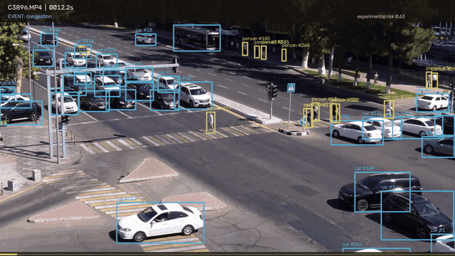
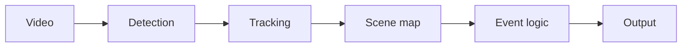

# traffic-vision

A fixed camera, a mapped junction, and timed traffic events.

I use pretrained [YOLO11s](https://docs.ultralytics.com/models/yolo11/) and [ByteTrack](https://github.com/FoundationVision/ByteTrack) to follow vehicles and pedestrians, then map those tracks onto a hand-labeled scene and turn the motion into events: congestion, failure to yield, and red-light running. A second, causal pass sketches accident risk from time-to-collision, hard braking, and the signal. Nothing here is fine-tuned on traffic-event labels.



Annotated excerpt from `C3896.MP4` (the checked-in site render). Boxes are YOLO11s tracks. The corner label is the event set the rules emitted at that time.

## Results

These numbers are from the development labels in `my_labels.json`, not a held-out test. The file has **118 reviewed intervals** from four clips of the same camera: 16 congestion, 83 failure-to-yield, 13 jaywalking, 4 red-light, and 2 stop-line.

At temporal IoU 0.5, the classes the current run actually emits have development precision **0.73** (congestion), **0.85** (failure to yield), and **1.00** (red light). Across all five classes that appear in the labels, Score A is **0.5084**. Jaywalking and stop-line stay in the official class list and are suppressed: this run emits no candidates for either, so their reported zero precision is not a candidate-rule precision. The labels still contain those 13 and 2 intervals.

The same detections and labels, with the signal rule changed from a red-priority vote to lamp position plus dominance, keep all 4 red-light matches, drop 2 green-phase false alarms, and move Score A from **0.4684** to **0.5084**.

`predictions_samples.json` has **100 events** and passes the format validator. It is the last completed sample output after those two green-phase red-light false alarms were removed. The last complete four-video timing pass used the earlier signal rule: 102 events, no format errors, and 625.3 s / 340.3 s (C3896), 539.2 s / 317.8 s (C3897), 555.1 s / 317.8 s (C3902), and 228.2 s / 127.6 s (C3905). That pass stayed inside the hard 3× budget (1.70–1.84×) and missed the preferred 1.5× target. A later all-video repeat of the seeded code exceeded the budget on C3896 and was stopped, so full-run timing for this exact version is still unverified. Two 10-second clean-environment smoke runs produced identical events and risk arrays (29.3 s and 20.7 s on the laptop used for that check).

The development set has no accident labels, so Part B is not scored or calibrated. Treat the risk curve as an experimental causal baseline.

The checked-in predictions file still carries the original export id `"team": "ICEBERG"`. The validator only requires that string to exist. New runs can pass `--team traffic-vision`.

## Pipeline



1. Read the clip. Downscale 4K frames to 1920 px width for inference, then put coordinates back in the source frame.
2. Detect road users with YOLO11s every third frame at 960 px.
3. Associate detections with ByteTrack.
4. Register the hand-labeled scene (lanes, crossings, stop line, signal, queue zone) to the first frame and attach smoothed motion, lane, road, queue, and signal features to each track.
5. Apply temporal rules, merge gaps shorter than 1 s, and drop fragments under 0.5 s. Congestion, failure to yield, and red light are emitted. Other official classes stay in the interface and stay off until a reviewed positive example supports a rule at the 0.7 development-precision gate.
6. Write event intervals. For the risk baseline, sample a causal tracker every 10 frames and fold time-to-collision, hard braking, and red-signal movement into a decaying score. `RiskEstimator.step()` only sees frames in order and does not open the video file.

## How to run

Python 3.10+. The YOLO11s weights are already in `weights/yolo11s.pt`.

```bash
python -m pip install -r requirements.txt --extra-index-url https://download.pytorch.org/whl/cu126
python run_submission.py --videos samples --out predictions_samples.json --team traffic-vision
python evaluate.py --pred predictions_samples.json --gt my_labels.json --per-video
python evaluate.py --pred predictions_samples.json --validate-only
```

`detect_events()` takes one video path. Sample and hidden-test runtime budget is 3× video duration for detection and risk together. `requirements.txt` pins the runtime. Python, NumPy, and PyTorch RNGs are seeded to 0 before each video. Output can still move if Ultralytics, PyTorch, CUDA, or the GPU changes.

The site lives in `website/`. From the repo root:

```bash
python -m uvicorn demo_api.app:app --host 127.0.0.1 --port 8000
cd website && npm ci && npm run dev
```

Vite proxies `/api` to that API. Rebuild charts with `python tools/build_site_data.py` after a new prediction file; rebuild the annotated clips with `python tools/render_site_videos.py` (extra packages in `tools/requirements_render.txt`). Uploads are capped at 2 minutes and 200 MB, resized to at most 1280×720, processed one at a time, and deleted afterward.

## Dataset and labeling

There is no external traffic-event training set. The detector is COCO-pretrained YOLO11s only. Sample video is not used for training.

The development set is four clips from one fixed camera. I labeled the junction geometry in CVAT (lanes, crossings, lights, queue zone, road outline) and stored the reviewed map in `src/scene.json`, in the 1920×1080 reference frame. Event intervals in `my_labels.json` follow the task's start and end rules, truncated at the video boundary. Tracking was only a way to find candidates. Each interval was checked against 4K crops and short overview sheets. Notes and the start/middle/end evidence images are in `labels/dev_labels_notes.md` and `labels/evidence/`.

`my_labels.json` is for rule review and threshold selection. It is not a held-out benchmark.

## Limitations

- One camera, four clips, and rules tuned on those same labels. Score A on this set is not a test-set score.
- Jaywalking (13 labels) and stop-line (2 labels) are not emitted. Their zero precision does not measure a candidate rule.
- The preferred 1.5× runtime target was missed on the last complete pass, and the current seeded code does not yet have a finished four-video timing run.
- Risk is uncalibrated: the development set has no accident intervals.
- The scene map is specific to this junction. A different angle or intersection needs a new map.
- Expected boxes can change across Ultralytics, PyTorch, and GPU versions even with the seed fixed.

## Credits

- Detection: Ultralytics YOLO11s, COCO 2017 weights (`weights/yolo11s.pt`, about 19 MB). Ultralytics code and the default model license are AGPL-3.0. This repository is AGPL-3.0. See the [Ultralytics licence](https://www.ultralytics.com/license).
- Tracking: ByteTrack, as shipped in Ultralytics (`bytetrack.yaml`). Original method: Zhang et al., *ByteTrack: Multi-Object Tracking by Associating Every Detection Box*, ECCV 2022. [Project page](https://github.com/FoundationVision/ByteTrack).
- Pretraining labels: COCO 2017 annotations are CC BY 4.0. Image copyright stays with each source. [COCO terms](https://cocodataset.org/#termsofuse).
- Sample-video rights stay with the source owners.

## Author

Azizbek Xasanov — [LinkedIn](https://www.linkedin.com/in/azizbek-xasanov/) · [GitHub](https://github.com/azxav)

Source: https://github.com/azxav/traffic-vision
